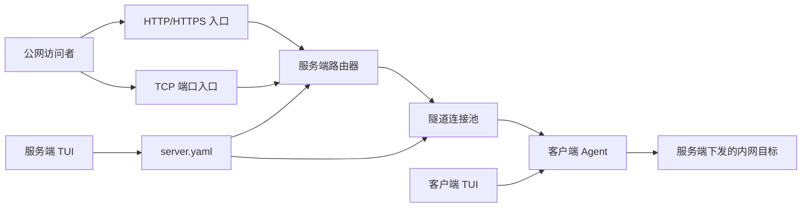

# GoPit 详细规划

## 1. 项目目标

构建一个 Go 语言实现的公网流量转发系统，由服务端和客户端组成。

- 服务端是配置和访问控制的唯一权威，负责管理客户端、Token、域名、公网端口和转发规则。
- 客户端只保存服务端地址和 Token，不保存或自主配置域名、公网端口、内网目标地址等转发规则。
- 一个客户端可维护多条长期隧道连接；每条隧道可复用多个逻辑通道。
- 同一隧道中的不同逻辑通道允许请求和响应数据交叉传输，同一逻辑通道内严格保序。
- 第一阶段支持 HTTP 域名转发和通用 TCP 端口转发；UDP 暂不支持。

## 2. 范围与非目标

### 2.1 第一阶段范围

- HTTP 域名路由和反向代理。
- 原生 TCP 端口转发。
- TLS 保护客户端与服务端之间的隧道。
- 服务端 TUI 管理客户端和转发规则。
- 客户端 TUI 完成首次注册、运行状态展示和手动重连。
- 服务端配置持久化、增量规则下发、断线重连和基础审计。

### 2.2 非目标

- UDP、QUIC 和音视频专用低延迟转发。
- 客户端本地自主新增、修改或删除转发规则。
- 多租户 Web 管理后台。
- 分布式服务端集群、高可用和跨节点会话迁移。
- 自动 ACME 证书签发，除非后续明确纳入范围。

## 3. 核心术语

| 名称 | 说明 |
| --- | --- |
| 客户端 | 部署在可访问内网服务的机器上的 `tunnel-client` 进程。 |
| 服务端 | 暴露公网入口并管理客户端与规则的 `tunnel-server` 进程。 |
| 隧道连接 | 客户端与服务端之间通过 TLS/TCP 建立的一条长期物理连接。 |
| 逻辑通道（Stream） | 在一条隧道连接中承载一条外部访问会话的虚拟双向数据流。 |
| 规则 | 服务端持久化的“公网入口到客户端内网目标”的授权映射。 |
| 控制面 | 鉴权、心跳、规则快照和规则增量同步等管理消息。 |
| 数据面 | 逻辑通道的打开、双向数据、半关闭和关闭消息。 |

## 4. 架构



服务端监听三类入口：

- 隧道监听端口：供客户端建立 TLS/TCP 长连接。
- HTTP/HTTPS 监听端口：根据请求 `Host` 匹配域名规则。
- TCP 监听端口：根据规则绑定的公网端口接收任意 TCP 流量。

## 5. 配置与持久化边界

### 5.1 客户端本地配置

客户端配置文件只允许包含以下内容：

```yaml
server:
  address: tunnel.example.com:7000
auth:
  token: replace-with-issued-token
```

客户端不得在本地配置文件中定义域名、外网端口、内网目标、规则启停状态或访问权限。

### 5.2 服务端基础配置

服务端 YAML 是唯一持久化来源，保存服务进程参数、客户端、Token、域名、公网端口和全部转发规则。服务端启动时加载该文件；服务端 TUI 和文件监听器都以该文件为配置源。

```yaml
server:
  tunnel_listen: ":7000"
  http_listen: ":80"
  https_listen: ":443"
  config_version: 1
security:
  admin_password_hash: "..."
tls:
  enabled: true
  certificate_file: "./certs/server.crt"
  private_key_file: "./certs/server.key"
clients:
  - id: client-shanghai-01
    name: shanghai-office
    token_hash: "$argon2id$..."
    enabled: true
http_routes:
  - id: route-api
    protocol: http
    host: api.example.com
    client_id: client-shanghai-01
    target: http://127.0.0.1:8080
    enabled: true
tcp_routes:
  - id: route-ssh
    protocol: tcp
    listen_port: 2222
    client_id: client-shanghai-01
    target: 127.0.0.1:22
    enabled: true
```

### 5.3 服务端业务数据

客户端、Token 和规则全部持久化在服务端 YAML 中。业务规则不会写入客户端；客户端仅接收属于当前 Token 对应客户端身份的运行时规则快照。

| 实体 | 主要字段 | 说明 |
| --- | --- | --- |
| 客户端 | ID、名称、Token 哈希、状态、创建时间、最后在线时间 | 一个 Token 对应一个受控客户端身份。 |
| HTTP 规则 | ID、协议、域名、客户端 ID、内网目标、启用状态 | 协议固定为 `http`，域名全局唯一。 |
| TCP 规则 | ID、协议、公网端口、客户端 ID、内网目标、启用状态 | 协议固定为 `tcp`，公网端口全局唯一。 |

Token 仅在创建或轮换时展示一次明文；YAML 中只保存 Argon2id 哈希值。第一期操作日志输出到服务端日志文件，不作为 YAML 业务实体存储。

### 5.4 YAML 更新与外部修改

- 服务端 TUI 对配置的新增、编辑、删除、启停和 Token 轮换均修改内存配置后写回 `server.yaml`。
- 写入采用“临时文件 -> 文件同步 -> 原子重命名”流程，防止宕机或磁盘异常留下半个 YAML 文件。
- 写入前重新校验完整配置，包括客户端 ID 引用、域名唯一性、端口唯一性、目标地址和协议格式。
- 每次有效配置变更将 `config_version` 加一；该版本是服务端和客户端同步状态的唯一依据。
- 服务端监听配置文件的外部改动。检测到变更后先完整解析和校验；校验成功则提升 `config_version`、热加载并通知客户端，校验失败则保留上一份生效配置并记录明确错误。
- TUI 写入期间应忽略自身原子重命名产生的文件监听事件，避免同一变更重复加载和重复推送。

## 6. 服务端 TUI

建议采用 `Bubble Tea`、`Bubbles` 和 `Lip Gloss` 实现终端可视化界面。

### 6.1 页面

| 页面 | 功能 |
| --- | --- |
| 概览 | 在线客户端数、启用规则数、当前流数、总吞吐和错误摘要。 |
| 客户端 | 创建、查看、禁用、删除客户端；生成和轮换 Token。 |
| HTTP 规则 | 新增、编辑、启停和删除域名转发规则；校验域名冲突。 |
| TCP 规则 | 新增、编辑、启停和删除端口转发规则；校验端口冲突。 |
| 在线会话 | 查看客户端远端地址、心跳、隧道数、活动流数与最近错误。 |
| 日志 | 查看鉴权、连接、配置变更和转发失败记录。 |

### 6.2 规则操作

服务端 TUI 新增规则时必须选择已创建的客户端，并填写：

- HTTP：外网域名、内网目标 URL、启用状态。
- TCP：公网监听端口、内网目标主机和端口、启用状态。

规则保存后：

1. 服务端校验域名或端口没有冲突。
2. 原子写回服务端 YAML，并递增 `config_version`。
3. 热加载生效配置；若目标客户端在线，立即下发配置变更。
4. 若规则被停用或删除，关闭该规则对应的新建入口，并终止已有逻辑通道。

手工编辑 `server.yaml` 与通过 TUI 编辑的配置具有相同的生效语义：合法变更经过校验后热加载，受影响客户端收到通知并自动请求完整规则快照；无须重启服务端或客户端。

## 7. 客户端 TUI

客户端 TUI 只负责注册、运行和观测，不提供规则编辑能力。

### 7.1 首次注册

1. 管理员在服务端 TUI 创建客户端，记录刚生成的 Token。
2. 在内网机器启动客户端 TUI。
3. 客户端 TUI 引导录入服务端地址和 Token，校验后写入客户端 YAML。
4. 客户端建立隧道并提交 Token。
5. 服务端验证成功后返回客户端身份，并推送规则快照。

### 7.2 运行界面

- 当前连接状态、认证状态、远端服务端地址和最近心跳。
- 当前已下发规则及其运行状态。
- 每条规则的活动流数、累计收发字节数、最近错误。
- 手动重连、临时停止接收新流、退出。

客户端不显示 Token 明文，运行日志也不得记录 Token 或完整认证报文。

## 8. 隧道连接与多路复用

### 8.1 连接池

每个客户端默认维护多条认证后的 TLS/TCP 隧道连接，建议默认值为 4 条。服务端为新的逻辑通道选择活动流数最少且可写的隧道。

```text
一个客户端
  ├─ 隧道 1：多个逻辑通道
  ├─ 隧道 2：多个逻辑通道
  ├─ 隧道 3：多个逻辑通道
  └─ 隧道 4：多个逻辑通道
```

多隧道连接池的目的：

- 复用长期连接，避免每个公网连接都重新进行 TLS 和认证。
- 允许大量规则和外部连接并发使用同一客户端。
- 降低单条 TCP 连接发生丢包或拥塞时对全部流量的影响。
- 某条隧道断开时，后续新流可分配到仍健康的隧道。

### 8.2 逻辑通道

每个逻辑通道使用全局唯一的 `stream_id` 标识，独立维护：

- 所属规则 ID 和规则版本。
- 公网连接与内网目标连接。
- 读写缓冲、窗口、字节计数和空闲超时。
- 输入关闭、输出关闭和完整关闭状态。

同一规则的每次公网 TCP 连接各占一个逻辑通道。HTTP 流量可按请求或按客户端到服务端的持久 HTTP 会话创建逻辑通道，具体实现优先采用“一个 HTTP 请求一个逻辑通道”，以保证取消、超时和异常隔离清晰。

### 8.3 数据交叉收发

不同 `stream_id` 的帧可在同一隧道中任意交叉出现；同一个 `stream_id` 内的数据帧必须严格按发送顺序处理。

```text
服务端 -> 客户端：OPEN_STREAM(stream_id=101, rule_id=api)
服务端 -> 客户端：OPEN_STREAM(stream_id=202, rule_id=admin)
服务端 -> 客户端：STREAM_DATA(stream_id=101, payload=A1)
服务端 -> 客户端：STREAM_DATA(stream_id=202, payload=B1)
客户端 -> 服务端：STREAM_DATA(stream_id=202, payload=B2)
客户端 -> 服务端：STREAM_DATA(stream_id=101, payload=A2)
```

在该示例中，`101` 与 `202` 的数据可以交叉传输；每一端均根据 `stream_id` 分发数据，因此不会发生响应串流或数据错配。

隧道的底层写入由单一写协程串行执行以保证帧完整性；每个逻辑通道独立拥有有界发送队列。调度器使用轮询或加权轮询从各通道队列取帧，避免大流量通道长期占用写入能力。

## 9. 内网连接复用策略

| 场景 | 策略 |
| --- | --- |
| 隧道连接 | 连接池复用，多条长期 TLS/TCP 连接承载多个逻辑通道。 |
| HTTP 内网目标 | 使用客户端 HTTP Transport 连接池复用 keep-alive 连接。 |
| WebSocket | 一个逻辑通道独占一条内网连接，直到任一端关闭。 |
| 长连接 TCP | 一个逻辑通道独占一条内网连接，不能跨外部会话复用。 |
| 短连接 TCP | 默认一条外部连接对应一条内网连接，确保任意协议的会话边界正确。 |

HTTP 内网连接复用只在相同目标、协议和连接可复用时生效。任意 TCP 业务不能盲目连接复用，否则无法判断不同外部会话的数据边界。

## 10. 协议设计

### 10.1 会话生命周期

```text
客户端连接
  -> 协议版本协商
  -> Token 鉴权
  -> 返回客户端身份与会话信息
  -> 推送携带配置版本的完整规则快照
  -> 保持心跳
  -> 接收配置变更通知并自动刷新规则
  -> 接收和处理逻辑通道数据
  -> 断线后指数退避重连
```

### 10.2 控制帧

控制帧可采用 JSON，便于排障与协议演进。

| 帧类型 | 方向 | 作用 |
| --- | --- | --- |
| `auth` | 客户端到服务端 | 提交协议版本、客户端元信息和 Token。 |
| `auth_result` | 服务端到客户端 | 返回鉴权结果、客户端 ID 和失败原因。 |
| `rules_snapshot` | 服务端到客户端 | 首次连接、版本不连续或热加载后下发当前客户端的完整启用规则及配置版本。 |
| `rules_changed` | 服务端到客户端 | 通知当前客户端其规则已变更，并附带最新配置版本。 |
| `rules_sync_request` | 客户端到服务端 | 客户端在发现版本不连续、规则执行失败或主动刷新时请求完整快照。 |
| `ping` / `pong` | 双向 | 维护心跳和延迟统计。 |
| `error` | 双向 | 报告可恢复或不可恢复协议错误。 |

### 10.3 数据帧

数据帧使用长度前缀二进制格式，字段包括帧类型、`stream_id`、规则 ID、标志位和载荷长度。必须限制单帧最大长度。

| 帧类型 | 作用 |
| --- | --- |
| `open_stream` | 服务端通知客户端为指定规则建立内网连接。 |
| `stream_data` | 某个逻辑通道的双向字节数据。 |
| `stream_half_close` | 一侧不再发送数据，但仍接收对端数据。 |
| `stream_close` | 关闭逻辑通道并释放关联资源。 |
| `window_update` | 更新通道可发送字节数，实现背压控制。 |

### 10.4 协议约束

- 未鉴权连接不得发送数据面帧。
- 服务端仅允许客户端处理其自身已授权且已启用的规则。
- 服务端收到未知 `stream_id`、无效规则 ID、超长帧或非法状态转换时关闭对应流；严重协议错误时关闭隧道。
- 每条隧道限制活动流数、单流缓冲上限、总写队列上限和帧大小。
- 通道读写超时、空闲超时和连接心跳超时必须可配置。

## 11. HTTP 与 TCP 转发流程

### 11.1 HTTP 域名转发

1. 外部请求到达服务端 HTTP/HTTPS 入口。
2. 服务端从 `Host` 查找唯一且启用的 HTTP 规则。
3. 服务端选择该规则所属在线客户端的一条健康隧道。
4. 服务端创建逻辑通道，发送请求头和请求体数据。
5. 客户端根据规则中的内网目标发起或复用 HTTP 连接。
6. 客户端通过相同 `stream_id` 返回响应头和响应体数据。
7. 服务端将响应返回给外部访问者并关闭或复用相关资源。

### 11.2 TCP 端口转发

1. 外部 TCP 连接到达服务端规则绑定的公网端口。
2. 服务端查找该端口对应的启用规则及在线客户端。
3. 服务端创建逻辑通道，向客户端发送 `open_stream`。
4. 客户端连接服务端下发的内网目标。
5. 两端在该 `stream_id` 上双向交叉转发字节数据。
6. 任意一端关闭时通过半关闭或关闭帧同步资源释放。

## 12. 安全、可靠性与可观测性

### 12.1 安全

- 客户端到服务端隧道默认使用 TLS。
- Token 使用高强度随机值，服务端保存 Argon2id 哈希。
- TUI 仅在 Token 创建或轮换时展示明文，默认掩码显示。
- 记录操作审计，不记录 Token、认证帧原文或敏感请求内容。
- 校验域名格式、目标地址格式、端口范围与域名/端口唯一性。
- 客户端禁用或 Token 轮换后，主动断开其隧道并撤销已分配流。

### 12.2 可靠性

- 客户端采用带随机抖动的指数退避重连。
- 心跳超时后服务端标记客户端离线，拒绝其新流量。
- 服务端规则变更必须原子写入 YAML、递增配置版本并通知受影响客户端。
- 规则快照带版本号；客户端检测到版本间断、收到变更通知或重新建立隧道时请求并应用完整快照。
- 客户端应用新快照时采用“先校验并准备新增规则，再停止已删除或已停用规则，最后原子切换运行时规则表”的方式，避免转发配置处于半更新状态。
- 单隧道异常只影响其已有流；新流优先使用健康隧道。

### 12.3 可观测性

- 结构化日志包含客户端 ID、规则 ID、流 ID、方向、耗时和错误分类。
- 统计在线客户端、健康隧道、活动流、转发字节、失败数、延迟和重连次数。
- 服务端 TUI 概览实时显示关键状态；客户端 TUI 显示本机已下发规则和错误。

## 13. 项目目录

```text
gopit/
  cmd/
    tunnel-server/       # 服务端可执行程序入口
    tunnel-client/       # 客户端可执行程序入口
  internal/
    protocol/            # 帧、编解码、版本协商与状态机
    tunnel/              # 隧道、流复用、写调度、心跳和重连
    config/              # YAML 配置读取与校验
    server/
      app/               # 服务端应用编排
      auth/              # Token 校验
      configstore/       # 服务端 YAML 读取、校验、原子写入和文件监听
      route/             # HTTP 域名和 TCP 端口路由
      configsync/        # 规则快照与增量下发
      tui/               # 服务端管理 TUI
    client/
      agent/             # 规则执行和隧道管理
      target/            # HTTP 和 TCP 内网目标连接
      tui/               # 客户端注册和运行状态 TUI
    observability/       # 日志、指标和审计
  configs/
    server.example.yaml
    client.example.yaml
  tests/
    integration/
  README.md
  Dockerfile
  docker-compose.yml
  go.mod
```

## 14. 实施阶段与验收标准

### 阶段一：工程与鉴权骨架

- 初始化 Go 模块、服务端和客户端命令。
- 加载 YAML 基础配置。
- 实现 TLS/TCP 隧道、版本协商、Token 鉴权和心跳。
- 服务端 TUI 能创建客户端和生成 Token。
- 客户端 TUI 能首次保存服务端地址与 Token，并显示认证状态。

验收：有效 Token 可连接，错误或已禁用 Token 被拒绝，服务端 TUI 可看到在线客户端。

### 阶段二：YAML 配置与规则管理

- 定义服务端 YAML 的客户端、HTTP 规则和 TCP 规则模型。
- 实现 YAML 完整校验、原子写入、配置版本和外部文件变更监听。
- 服务端 TUI 实现规则的新增、编辑、启停和删除，并原子写回 YAML。
- 实现携带配置版本的完整规则快照、变更通知和客户端主动同步。

验收：服务端重启后客户端和规则不丢失；TUI 操作或手工修改合法 YAML 后，在线客户端均可自动收到并应用规则更新；非法 YAML 不影响当前生效配置。

### 阶段三：多通道隧道与 HTTP 转发

- 实现 `stream_id`、通道状态机、有界队列和背压控制。
- 实现隧道内交叉数据帧调度和同通道顺序保证。
- 实现服务端 HTTP Host 路由和客户端内网 HTTP 代理连接池。

验收：同一客户端的多个域名可并发转发；并发请求的请求和响应交叉传输但不串流；HTTP 内网连接可复用。

### 阶段四：通用 TCP 转发与连接池

- 实现服务端动态 TCP 端口监听。
- 实现客户端到内网目标的双向 TCP 转发。
- 实现客户端多隧道连接池和服务端负载选择。
- 实现半关闭、空闲超时和断线资源回收。

验收：多个公网端口可绑定同一客户端；多个 TCP 会话并发工作；一条隧道断开后新流仍可分配到健康隧道。

### 阶段五：完整性与交付

- 补充单元测试和端到端测试。
- 覆盖鉴权、规则冲突、规则热更新、交叉收发、背压、断线重连和客户端离线。
- 补充 Docker、部署、证书、备份、恢复和故障排查文档。

验收：在本地集成环境中完成 HTTP 和 TCP 转发全链路验证，且所有 Go 测试和静态检查通过。

## 15. 待确认决策

开始编码前需要确认以下事项：

1. 第一阶段是否同时实现 HTTP 域名转发和通用 TCP 端口转发。
2. 服务端客户端、Token 和全部转发规则确认仅使用 YAML 持久化，且服务端监听手工修改的 YAML 并热加载。
3. 第一阶段 TLS 是否使用手工配置的证书文件；自动申请 Let's Encrypt 证书是否作为后续功能。
4. 默认隧道连接池大小是否采用每客户端 4 条长期连接，并允许后续通过服务端基础配置调整。
